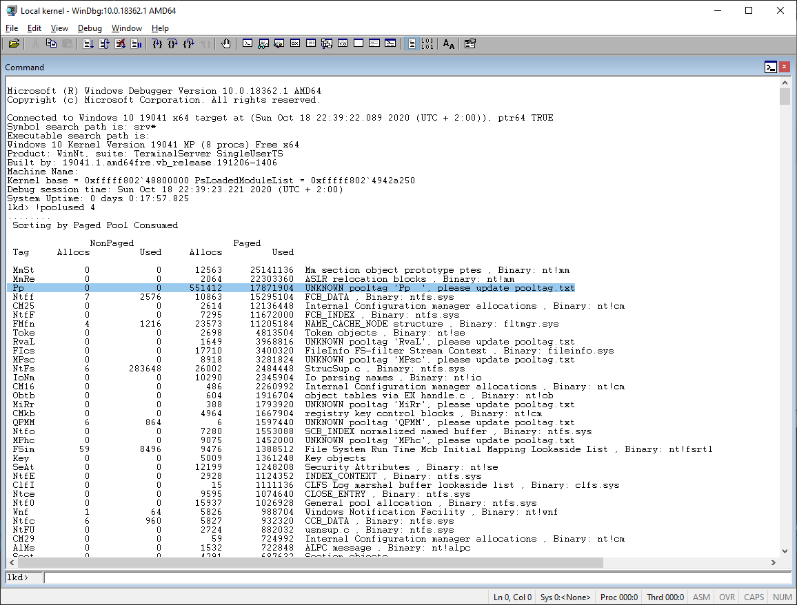
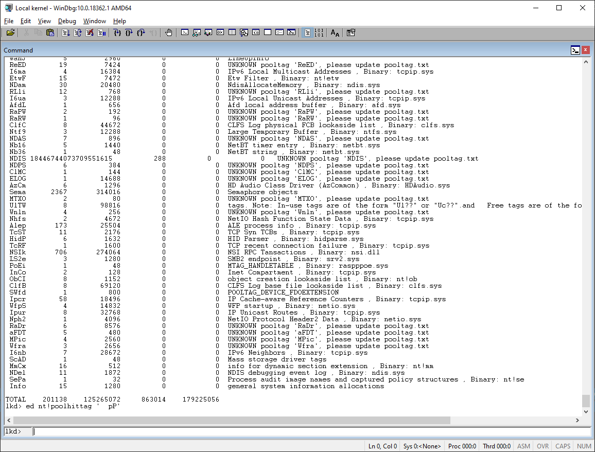
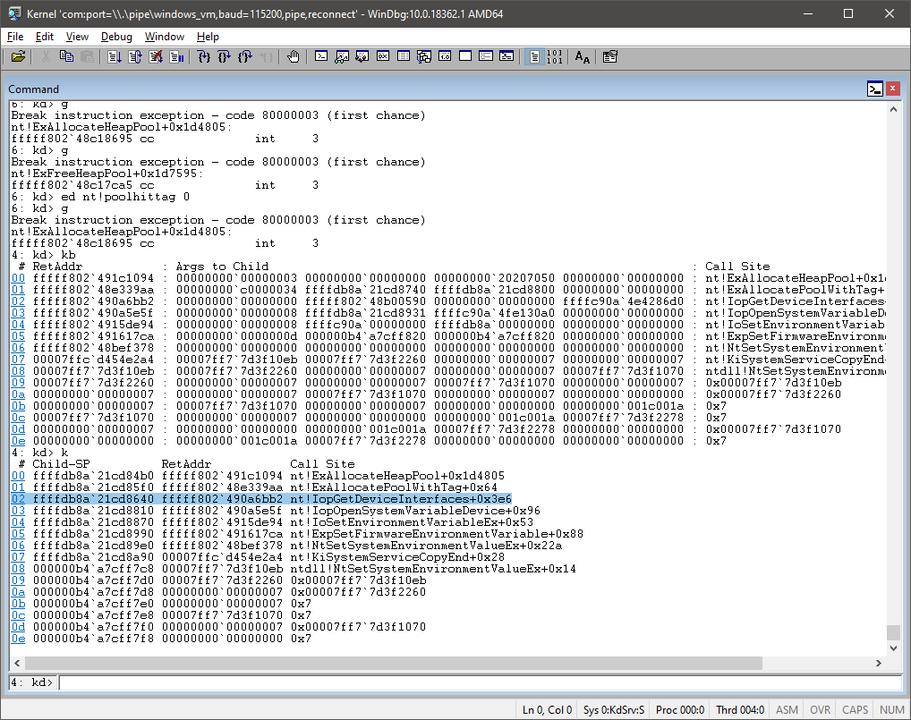
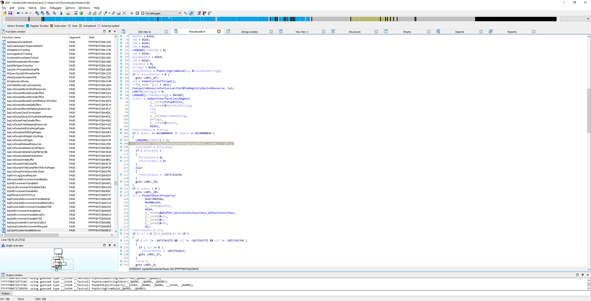
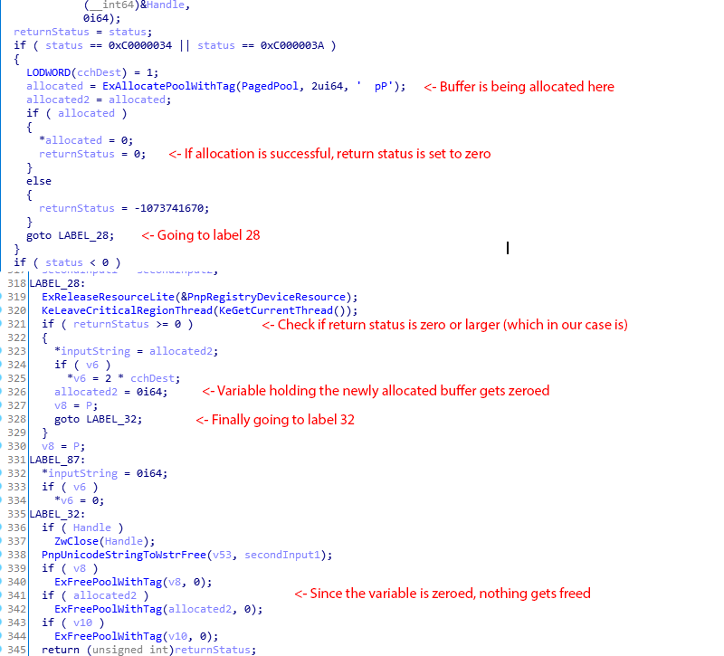

# Memory leak in IopGetDeviceInterfaces
After few days of debugging my kernel-mode driver to figure out why hooking EFI runtime services function causes leak in paged memory, I noticed weird thing... It happens even without the driver loaded!

To figure out where it comes from, I started by looking which pool tag is being used. Quick look in WinDbg showed me that it's pool tag "Pp" that is constantly gaining size.

Now there was nothing easier then to set breakpoint to the pool allocation.

After the breakpoint was hit, I could see exactly where it was coming from.

Relocated image in IDA and found exactly the line.

There we go.

Running Windows 10 x64 Pro 2004 (19041.264). Would be nice if you fixed this Microsoft. It's just small leak but it's annoying.